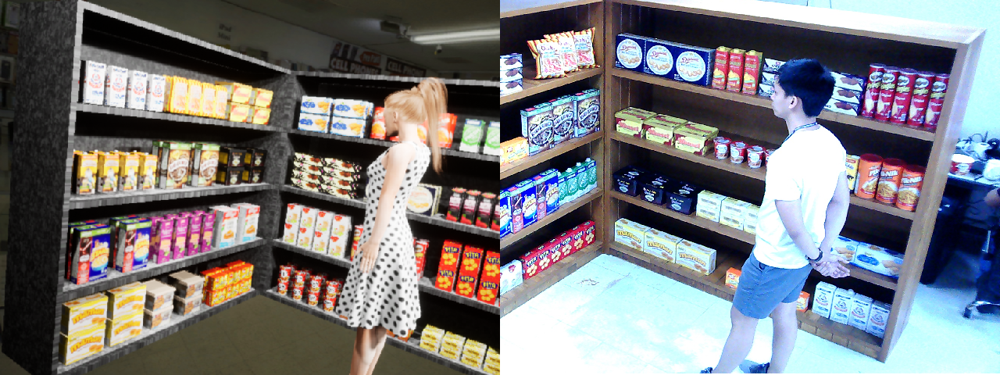
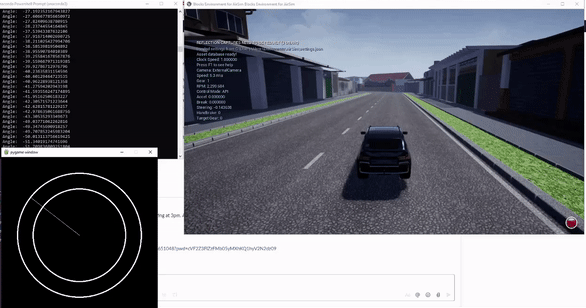

# Henri Marcelo B. Tomas, MS EE Student
BS ECE Graduate - MS EE Student, Majoring in AI and Computer Vision

Electrical and Electronics Engineering Institute, University of the Philippines

Research interests: AI, Vision, Speech, Language, and Robotics

## Major Projects

==============================

#### 1. **Gaze-On-Objects**

_Role: Researcher and Author_

The Gaze-on-Objects (GOO) dataset consists of synthetic and real images of people looking at objects in a retail environment. The dataset is used for traning and evaluation on the task of Gaze Object Prediction: given a single image with a person and this person's head location, the object beng gazed at must be determined. 

#### 2. **CitySim PH**

_Role: Researcher_

The CitySim PH project aims to create a simulated environment for training self-driving vehicles and UAVs to navigate around urban streets in the Philippines. This project is currently on hold. 

#### 3. **Binarized-MobileNet SSD**

_Role: Researcher_

An undergraduate thesis on converting lightweight object detection networks (SSD-MobileNet) into partial binary neural networks (BNNs) to achieve faster inference times on limited compute (CPU only). 

### Toy Projects
